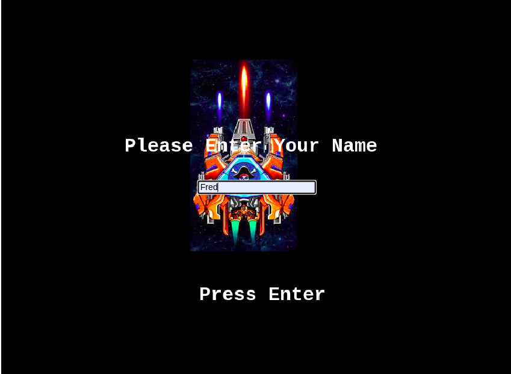
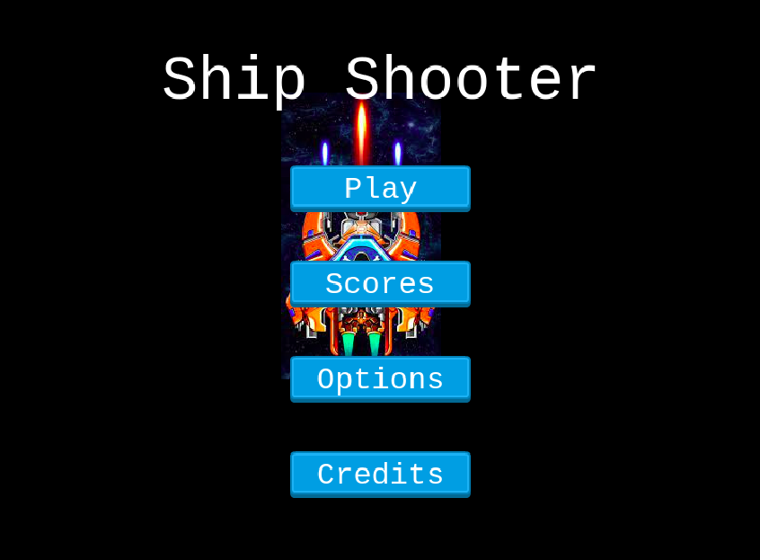
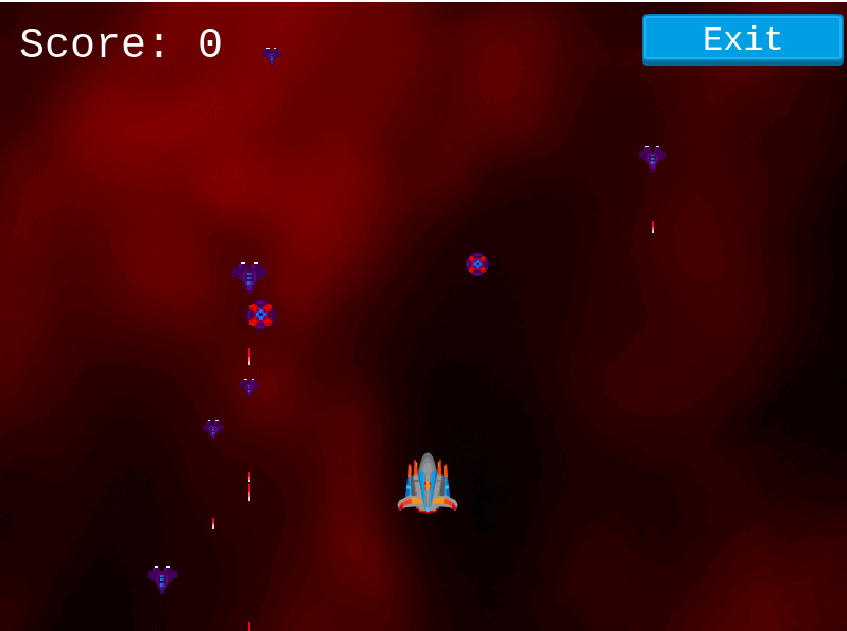
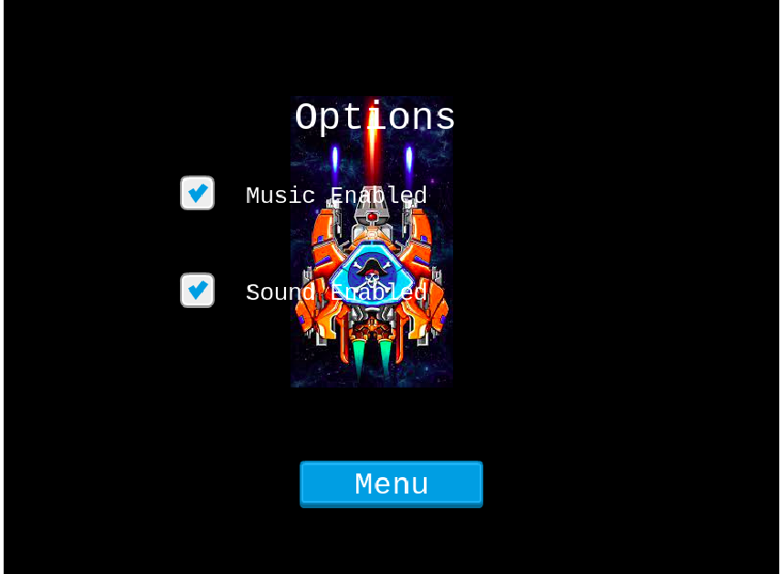
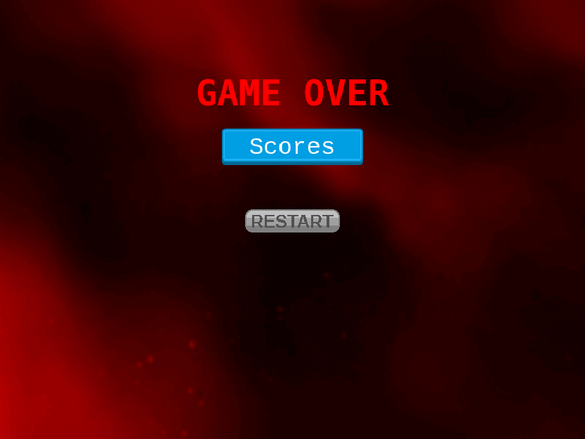

# Shooter Game


## Description

Our country is constantly being attacked by unknown armed gunmen.
They kill our citizens. We need help!
We need a command ship to protect our citizens. 
The goal is to eliminate all of the gunmen by shooting them. The gunmen attempt to destroy the player by firing projectiles(lasers).
player is given the ability to fire lasers at moving enemies.
Game over is triggered by the enemies killing the player by getting hit by lasers from unknown gunmen (either by getting hit by lasers or enemies ) rather than simply a timer running out.


### How it looks








## Live Demo Link

[Play Live](https://60e1ae9a582304c421eee34c--epic-newton-20dc9c.netlify.app/)
### Gameplay

To play the game follow the instruction below:
**Start**
To start playing,  click the button PLAY

**Movement instruction:**
- W - move main character up
- S - move main character down
- D - move main character right
- A - move main character left
- SPACE - hold down to release projectiles to destroy gun-men.

**Battle instruction**
- Player can use the `space bar` to shoot enemy ships.
- If a player ship collides with enemy ship, both ships get destroyed and game is over
- If enemy ship's laser shoots at players's ship it explodes and game is over
- The player has to shoot as many enemy ships as he can to earn more points.

- Payer can use the restart button to restart the gameplay

**Leaderboard**
- To view the leaderboard, user should click on `board` button to displayed when user's scores.
## To get the game running on your local machine

Clone or fork the source code into your local machine
```
git clone https://github.com/FrederickMih/Shooter-Game/tree/shooter
```
```cd``` into the cloned directory using
```
cd directory-name/
```

Open the directory in your favorite code editor e.g if your using Vs code
```
code .
```

To install dependencies run
``` 
npm install
 ```

To open the game in your browser run 
```
npx webpack or npx start
```

## Running tests

In the root directory, run

```
npm run test
```

## Built With

- HTML 
- CSS
- Linter
- JS
- Webpack
- VScode
- Phaser

## Acknowledgements

I used  Sprites from
- [York Computer Solutions LLC](https://learn.yorkcs.com/)


## Author
👤 **Mih Frederick**

[](https://github.com/FrederickMih)
[](https://www.linkedin.com/in/frederick-mih/)
[](https://twitter.com/MihFrederick)


## 🤝 Contributions

Contributions, issues and feature requests are welcome!

Feel free to check the [issues page](https://github.com/FrederickMih/Shooter-Game/issues).


## Show your Support
Give a ⭐ if you like this project!